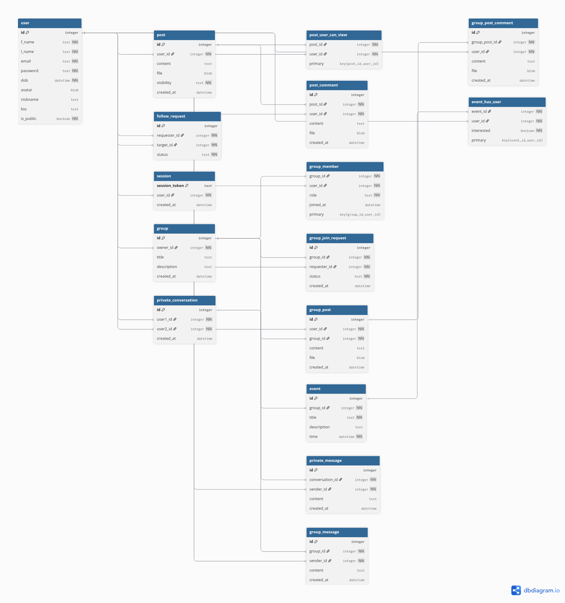

<div align="center">
  
  <br />

# BrainBook 📖

**A Social Network for Knowledge Sharing**

[](https://golang.org/)
[](https://nuxt.com/)

</div>

---

## 📖 Table of Contents

- [Overview](#overview)
- [Features](#features)
- [Technology Stack](#technology-stack)
- [Database Schema](#database-schema)
- [Getting Started](#getting-started)
- [API Documentation](#api-documentation)
- [Project Structure](#project-structure)
- [Authors](#authors)
- [License](#license)

---

## 🌟 Overview

BrainBook is a feature-rich social networking platform designed specifically for knowledge sharing between researchers and developers. It provides a comprehensive suite of tools for collaboration, including user profiles, posts, groups, real-time messaging, and notifications.

### Key Highlights

- **Secure Authentication**: Session-based authentication with encrypted cookies
- **Privacy Controls**: Public and private profiles with granular post visibility
- **Real-time Communication**: WebSocket-powered instant messaging and notifications
- **Group Collaboration**: Create groups, share posts, organize events, and chat
- **Rich Media Support**: Support for images (JPEG, PNG) and GIFs in posts and comments
- **Followers System**: Private following with automatic approval for public profiles

---

## ✨ Features

### 🔐 Authentication

Complete user registration and login system with persistent sessions:

- **Registration Requirements**:
  - Email (mandatory)
  - Password (mandatory, securely hashed)
  - First Name & Last Name (mandatory)
  - Date of Birth (mandatory)
  - Avatar/Image (optional)
  - Nickname (optional)
  - About Me/Bio (optional)

- **Session Management**: Users remain logged in until they explicitly logout, with secure session tokens stored in HTTP-only cookies

### 👤 User Profiles

Each user has a comprehensive profile featuring:

- Personal information (excluding password)
- User activity and posts
- Followers and following lists
- **Profile Types**:
  - **Public Profile**: Visible to all users
  - **Private Profile**: Visible only to accepted followers
- Profile visibility toggle for authenticated users

### 👥 Followers System

Dynamic follow/unfollow functionality with request management:

- Send follow requests to other users
- Accept or decline incoming follow requests
- **Auto-follow**: Public profiles automatically accept follow requests
- View followers and following lists
- Unfollow capability for existing connections

### 📝 Posts & Comments

Create and interact with content:

- Create posts with optional images/GIFs
- Comment on posts with optional media
- **Privacy Levels**:
  - **Public**: Visible to all users
  - **Almost Private**: Visible only to followers
  - **Private**: Visible only to selected followers
- Real-time updates and interactions

### 👨‍👩‍👧‍👦 Groups

Collaborative spaces for focused discussions:

- Create groups with title and description
- Invite users to join groups
- Request to join existing groups (requires owner approval)
- Browse all available groups
- **Group Features**:
  - Group posts and comments (visible only to members)
  - Group chat rooms for real-time communication
  - Event creation and management
  - RSVP system (Going/Not Going)

### 💬 Real-time Chat

Instant messaging with WebSocket technology:

- **Private Messages**: Send messages to followers or users you're following
- **Group Chat**: Common chat room for all group members
- **Features**:
  - Real-time message delivery
  - Emoji support
  - Online/offline status indicators
  - Typing indicators
  - Message history

### 🔔 Notifications

Comprehensive notification system for important events:

- Follow requests (for private profiles)
- Group invitations
- Group join requests (for group owners)
- Event notifications (for group members)
- Real-time notification delivery via WebSocket

---

## 🛠️ Technology Stack

### Frontend

- **Node.js**: 22.21.0
- **Package Manager**: PNPM 10.19.0
- **Framework**: Nuxt 4.2.0 (Vue.js v3)
- **UI Library**: Nuxt UI Pro
- **Styling**: TailwindCSS (via Nuxt UI)
- **Utilities**: VueUse, date-fns

### Backend

- **Language**: Go 1.25
- **Database**: SQLite 3
- **Migrations**: golang-migrate/migrate
- **Security**:
  - golang.org/x/crypto/bcrypt (password hashing)
  - google/uuid (session tokens)
- **Real-time**: gorilla/websocket

### Allowed Go Dependencies

As per project requirements, only the following external Go packages are used:

- `github.com/gorilla/websocket` - WebSocket implementation
- `golang.org/x/crypto/bcrypt` - Password hashing
- `github.com/golang-migrate/migrate` - Database migrations
- `github.com/mattn/go-sqlite3` - SQLite driver
- `github.com/google/uuid` - UUID generation

---

## 🗄️ Database Schema

<div align="center">
  
</div>

### Core Tables

#### Users & Authentication
- **user**: User profiles and account information
- **session**: Active user sessions with tokens
- **follow_request**: Follow relationships and requests

#### Content
- **post**: User posts with privacy settings
- **post_user_can_view**: Private post visibility control
- **post_comment**: Comments on posts

#### Groups
- **group**: Group information
- **group_member**: Group membership
- **group_join_request**: Requests to join groups
- **group_post**: Posts within groups
- **group_post_comment**: Comments on group posts
- **group_message**: Group chat messages

#### Events
- **event**: Group events
- **event_has_user**: Event RSVP tracking

#### Messaging
- **conversation**: Private conversations between users
- **conversation_message**: Private messages

---

## 🚀 Getting Started

### Prerequisites

Ensure you have the following installed:

- Go 1.25 or higher
- Node.js 22.20 or higher
- PNPM 10.18 or higher

### Installation

1. **Clone the repository**
   ```bash
   git clone https://github.com/yourusername/social-network.git
   cd social-network
   ```

2. **Backend Setup**
   ```bash
   cd backend

   # Install dependencies
   go mod download

   # Start the backend server
   go run .
   ```

   The backend server will start on `http://localhost:8080`

3. **Frontend Setup**
   ```bash
   cd frontend

   # Install dependencies
   pnpm install

   # Start the development server
   pnpm dev
   ```

   The frontend development server will start on `http://localhost:3000`

### Environment Variables

#### Backend

Create a `.env` file in the `backend` directory (optional, defaults are provided):

```env
BASE_URL=http://localhost:8080
HTTP_PORT=8080
DB_DSN=db.sqlite
DB_AUTOMIGRATE=true
```

#### Frontend

Configure API endpoint in `nuxt.config.ts` if needed.

### Building for Production

**Backend:**
```bash
cd backend
go build -o brainbook-api
./brainbook-api
```

**Frontend:**
```bash
cd frontend
pnpm build
pnpm preview
```

---

## 📚 API Documentation

Complete API documentation is available in the OpenAPI 3.1 specification file: [`openapi.yaml`](openapi.yaml)

### API Structure

- **Public Routes** (`/v1/*`): No authentication required
  - `POST /v1/register` - User registration
  - `POST /v1/login` - User login

- **Protected Routes** (`/protected/v1/*`): Authentication required
  - **Profiles**: `GET /protected/v1/profiles/user/{id}`
  - **Followers**: `GET/POST /protected/v1/user/{id}/followers`
  - **Posts**: `GET/POST /protected/v1/posts`
  - **Comments**: `POST /protected/v1/comments`
  - **Groups**: `GET/POST /protected/v1/groups/*`
  - **Messaging**: `GET /protected/v1/private-messages/{id}`
  - **WebSocket**: `GET /protected/ws`

### Authentication

The API uses session-based authentication with HTTP-only cookies:

1. Login via `POST /v1/login`
2. Receive `session_token` cookie
3. Include cookie in subsequent requests
4. Logout via `POST /protected/v1/logout`

---

## 📁 Project Structure

```
social-network/
├── backend/                    # Go backend
│   ├── api/                   # API handlers and routing
│   │   ├── websocket/        # WebSocket implementation
│   │   ├── core_*.go         # Core server components
│   │   └── handler_*.go      # Route handlers
│   ├── assets/               # Embedded assets
│   │   └── migrations/       # SQL migration files
│   ├── internal/             # Internal packages
│   │   ├── database/         # Database layer
│   │   ├── security/         # Security utilities
│   │   ├── cookie/           # Cookie management
│   │   ├── validator/        # Input validation
│   │   └── ...              # Other utilities
│   ├── main.go               # Application entry point
│   ├── go.mod                # Go dependencies
│   └── db.sqlite            # SQLite database (generated)
│
├── frontend/                  # Nuxt/Vue frontend
│   ├── app/                  # Application code
│   │   ├── components/       # Vue components
│   │   ├── pages/           # Page components
│   │   ├── layouts/         # Layout components
│   │   ├── composables/     # Vue composables
│   │   └── assets/          # Static assets
│   ├── nuxt.config.ts       # Nuxt configuration
│   ├── package.json         # Node dependencies
│   └── tsconfig.json        # TypeScript config
│
├── openapi.yaml              # API documentation
├── requirements.md           # Project requirements
├── model.png                 # Database schema diagram
├── logo.png                  # Project logo
├── LICENSE                   # MIT License
└── README.md                # This file
```

---

## 👨‍💻 Authors

This project was created by:

- **Ahmed Almadhoob**
- **Abdulla Alasmawi**
- **Mohamed AlAlawi**

---

## 📄 License

This project is licensed under the MIT License - see the [LICENSE](LICENSE) file for details.

---

## 🙏 Acknowledgments

- Frontend template based on [Nuxt UI Pro](https://ui.nuxt.com/).
- Built with ❤️ for Reboot Coding Institute.

---

<div align="center">

**[⬆ Back to Top](#brainbook-)**

Made with 🧠 by the BrainBook Team

</div>
